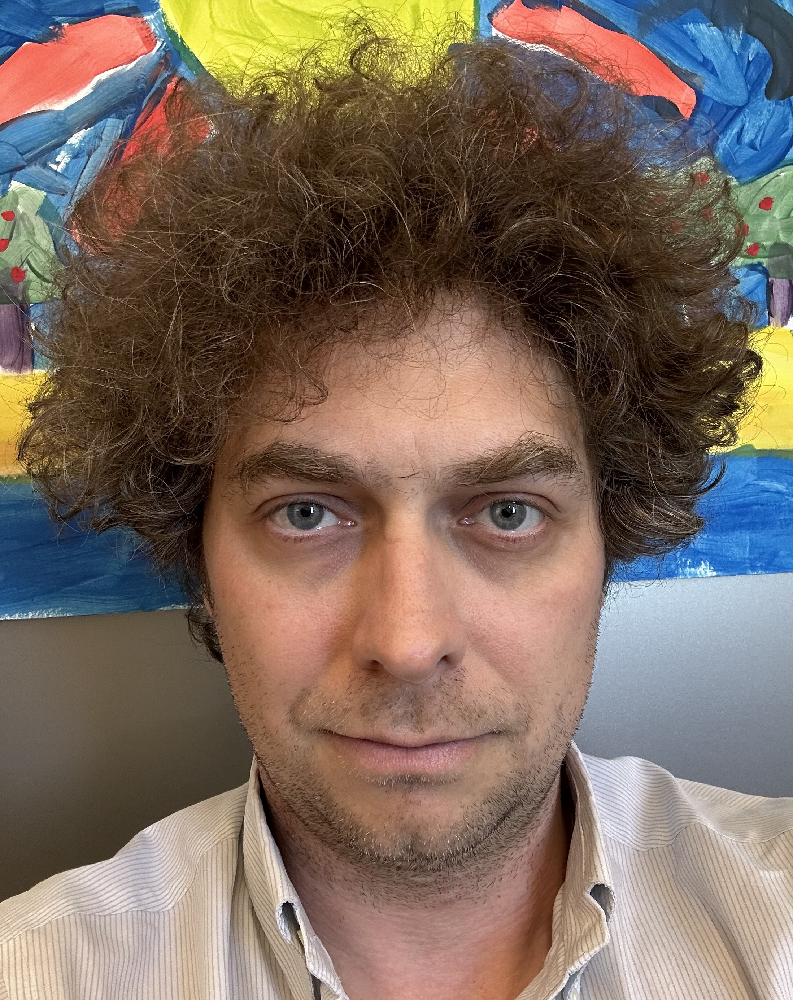

I am a theorist working on quantum information and quantum computing. 

I am an Associate Professor in [Applied Mathematics](https://uwaterloo.ca/applied-mathematics/). 

I am also a member of [IQC](https://uwaterloo.ca/institute-for-quantum-computing), an affiliate at [Perimeter](https://perimeterinstitute.ca/) and a Fellow Adjoint at [JILA](https://jila.colorado.edu/). 
 

# NEWS: I now have a website!

[Come work with me!](/jobs2024/)

### Research Interests
- Quantum Shannon Theory
- Quantum Networks
- Mathematical Physics
- Physics of Information
- Entanglement
- Error Correction
- Estimation, Characterization, Sensing

# My Group

###  Graduate Students
- [Alex Kazachek](https://akazachek.com/)
- Shreyas Natarajan
- Sukanya Ghosal

 
### Current Postdocs
- [Paula Belzig](https://paulabelzig.wordpress.com/about-me/)
- [Alex Meiburg](https://ohaithe.re/)
- [Peixue Wu](https://pxwu24.github.io/academic/)
- Yunkai Wang

# Past Group Members

### Undergraduates
- Aaron Barbosa (2019, now at QCTRL)
- Jenny Hou-Heng Leong (2022-2023, now at SOKENDAI)
- [Luke Coffman](https://www.linkedin.com/in/lukercoffman/) (2021-2023)

###  Graduate Students
- [Joshua Levin](https://www.linkedin.com/in/joshua-levin-09a011104/) (PhD 2022, now at QCWare)
- [Anthony Polloreno](https://www.linkedin.com/in/ampolloreno/) (PhD 2023, Now at EssentialAI)
- [Mohammad Alhejji](https://www.linkedin.com/in/mohammad-alhejji-096b1a57/) (co-advisor, PhD 2023, now at UNM)
- [Jacob Beckey](https://www.jacobbeckey.com/about/) (PhD 2024, now at UIUC)
- [Ariel Shlosberg](https://www.linkedin.com/in/ariel-shlosberg-80a946155/) (PhD 2024, now at UNM)
-  [Sristy Agrawal](https://www.linkedin.com/in/sristy-agrawal-718a17ba/) (PhD 2024, now CEO of [Mesa Quantum](https://mesaquantum.com/))

### Postdocs
- [Maris Ozols](https://homepages.cwi.nl/~maris/) 
- [Ke Li](https://homepage.hit.edu.cn/keli)
- [Felix Leditzky](https://felixleditzky.info/)
- Vikesh Siddhu (now at IBM Research) 
  

# FAQ

